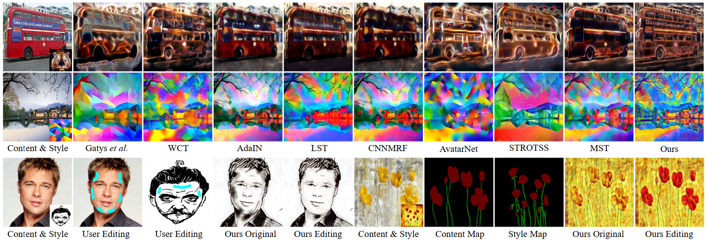

## Manifold Alignment for Semantically Aligned Style Transfer
**[[Paper]](https://arxiv.org/pdf/2005.10777.pdf)** 


<span id="gui_demo"></span>

## Getting Started
MAST has been tested on CentOS 7.6 with python >= 3.6. It supports both GPU and CPU inference. If you don't have a 
suitable device, try running our [Colab demo](https://colab.research.google.com/drive/1JVGtVCk9D7c7fZv_CTmu-8dNz_x0d7NO?usp=sharing).

Clone the repo:
```
git clone https://github.com/NJUHuoJing/MAST.git
```

prepare the checkpoints:
```
cd MAST_RELEASE
chmod 777 scripts/prepare_data.sh
scripts/prepare_data.sh
```

Install the requirements:
```
conda create -n mast-env python=3.6
conda activate mast-env
pip install -r requirements.txt

# If you want to use post smoothing as the same as PhotoWCT, then install the requirements below;
# You can also just skip it to use fast post smoothing, remember to change cfg.TEST.PHOTOREALISTIC.FAST_SMOOTHING=true
pip install -U setuptools
pip install cupy
pip install pynvrtc
```

## Running the Demo
### Artistic style transfer
First set `MAST_CORE.ORTHOGONAL_CONSTRAINT=false` in [`configs/config.yaml`](configs/config.yaml). 
Then use the script [`test_artistic.py`](test_artistic.py) to generate the artistic stylized image by following 
the command below:
```
# not use seg
python test_artistic.py --cfg_path configs/config.yaml --content_path data/default/content/4.png --style_path data/default/style/4.png --output_dir results/test/default

# use --content_seg_path and --style_seg_path to user edited style transfer
python test_artistic.py --cfg_path configs/config.yaml --content_path data/default/content/4.png --style_path data/default/style/4.png --output_dir results/test/default --content_seg_path data/default/content_segmentation/4.png --style_seg_path data/default/style_segmentation/4.png --seg_type labelme --resize 512
```

### Photo-realistic style transfer
First set `MAST_CORE.ORTHOGONAL_CONSTRAINT=true` in [`configs/config.yaml`](configs/config.yaml). 
Then use the script [`test_photorealistic.py`](test_photorealistic.py) to generate the photo-realistic stylized image 
by following the command below:
```
# not use seg
python test_photorealistic.py --cfg_path configs/config.yaml --content_path data/photo_data/content/in1.png --style_path data/photo_data/style/tar1.png --output_dir results/test/photo --resize 512

# or use --content_seg_path and --style_seg_path to user edited style transfer
python test_photorealistic.py --cfg_path configs/config.yaml --content_path data/photo_data/content/in1.png --style_path data/photo_data/style/tar1.png --output_dir results/test/photo --content_seg_path data/photo_data/content_segmentation/in1.png --style_seg_path data/photo_data/style_segmentation/tar1.png --seg_type dpst --resize 512
```

## GUI For Artistic style transfer and User Editing
We provide a gui for user-controllable artistic image stylization. Just use the command below to run [`test_gui.py`](test_gui.py)
```
python test_gui.py --cfg_path configs/config.yaml
```
### Features
1. You can use different colors to control the style transfer in different semantic areas.
2. The button `Expand` and `Expand num` respectively control whether to expand the selected semantic area and the 
   degree of expansion.

See the [gif demo](#gui_demo) for more details.

## Google Colab
If you do not have a suitable environment to run this project then you could give Google Colab a try. It allows you 
to run the project in the cloud, free of charge. You may try our Colab demo using the notebook we have 
prepared: [Colab Demo](https://colab.research.google.com/drive/1JVGtVCk9D7c7fZv_CTmu-8dNz_x0d7NO?usp=sharing)

## Citation
```
@inproceedings{huo2021manifold,
  title={Manifold Alignment for Semantically Aligned Style Transfer},
  author={Huo, Jing and Jin, Shiyin and Li, Wenbin and Wu, Jing and Lai, Yu-Kun and Shi, Yinghuan and Gao, Yang},
  booktitle={Proceedings of the IEEE/CVF International Conference on Computer Vision},
  pages={14861--14869},
  year={2021}
}
```
## References
- The post smoothing module is borrowed from [PhotoWCT](https://github.com/NVIDIA/FastPhotoStyle)
